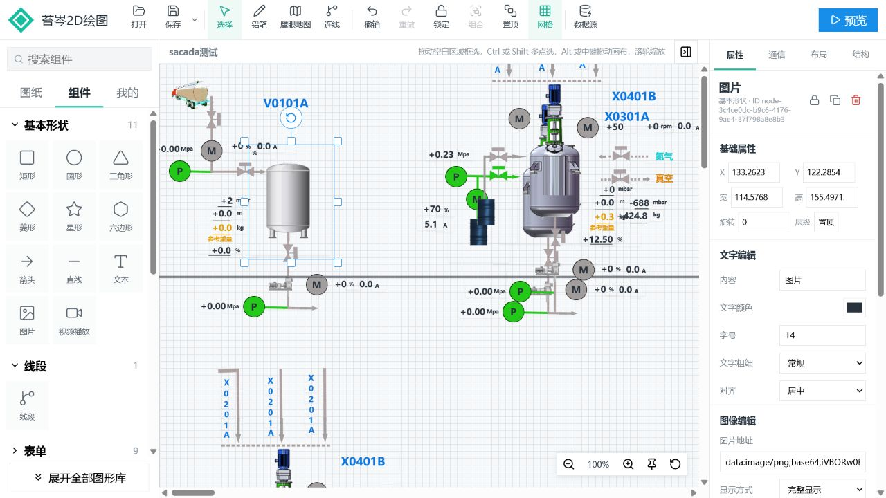

# 苔岑 SCADA 2D 编辑器（TC2D）

一个开源的 Web SCADA/HMI 2D 工业组态与数据可视化编辑器，基于 Vue 3、Canvas 和 SVG，支持组件拖拽、动画、数据绑定及大图纸预览。

Open-source SCADA/HMI 2D editor for industrial automation and data visualization, built with Vue 3, Canvas and SVG.



## 功能

- 拖拽绘制流程图、工业设备、图表、表单和动画组件
- 线段默认四等分，支持设置分段数并直接拖拽节点编辑折线路径
- 支持连线、组合、图层、缩放、撤销重做和实时预览
- 支持图纸管理、数据源配置和组件数据绑定
- 针对大型图纸提供渐进渲染和 Canvas 性能优化

## 开始使用

```bash
npm install
npm run dev
```

技术栈：Vue 3、Vite、JavaScript、SVG、Canvas。

关键词：SCADA、HMI、工业组态、工业自动化、数据可视化、低代码、2D 编辑器、Vue 3、Canvas、SVG。

[查看详细文档](docs/系统介绍.md)
